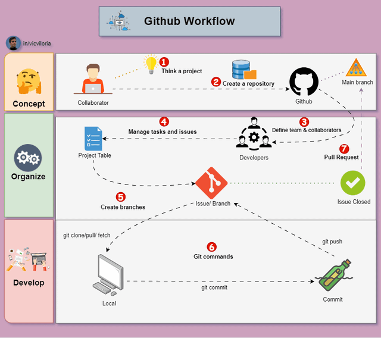

# Git-Series-00

## About Me

 This repository is created to learn the basics of GitHub and how I can use it in the future to share my work with teammates or save my work with a history of changes. In the beginning, I didn't have any experience, not even basic knowledge of GitHub, until I enrolled in this master's program. After a year of learning, I can now use it, at least at a basic level. However, I am still in the learning process and would like to develop a more advanced understanding of GitHub.

## GitHub Workflow Image

## Why I want to learn Python, R, and Git

In modern times, digitalization is taking place in every field, and learning Python skills has become more important.
I want to learn Python for better data analysis and automation.
Similarly, I want to learn R for good statistical analysis of research data.
These digital tools will help me work more efficiently in my academic projects.
They can also benefit me when I enter my professional life.

## What I Learned

I learned the basic Git operations using GitHub Desktop.
I learned how to create a repository and commit the changes I made in VS Code.
I also learned how to add pictures and push all my commits to a branch so they are saved in the history.
Now, whenever I want to look at a specific step of my assignment or a task, I can go directly to the commit history instead of searching for it again.
I also understand better which methods and Git operations I used to complete my assignment.

This assignment took me approximately 30 minutes to complete.

## Question/Answers
Ans 1. 
Push is used to send my local commits to the remote repository on GitHub.

A branch is a separate version of the repository where I can work on changes without directly changing the main branch.

Clone is used to make a copy of a repository from GitHub to my local computer so I can work on it locally.

Diff shows the differences between the changes I have made and the previous version of the file.

Commit saves the changes I made in the local Git history with a message explaining what I changed.

Ans 2. RANK
1.Commit
2. Push
3. Branch
4. Diff
5. Clone